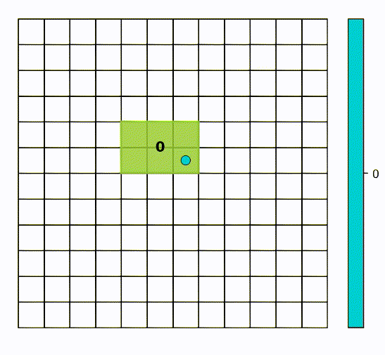

# RL-PCB




This repository provides an implementation of a dummy gym environment to model a simplified version of the PCB problem where a set of 2D rigid bodies marked with points (called pins) are placed in a grid of fixed size $h \times w$. The goal is to place components optimally such that routing is made as easy and efficient as possible.

The repository additionally provides agets that can be used to solve this problem using Proximal Policy Optimization (PPO). Various policy networks for training 
agents are provided. Additionally, the repository provides a web-app made by streamlit for training, visualizing and comparing the performance of agents. 

---

## Installation

This repository runs on Python 3.9. Due to compatibility issues with Tensorflow and Windows, the repository is only supported on Linux and MacOS. Additionally, due to compatibility issues with Tensorflow and MacOS separate requirements files are provided for Linux and MacOS.

### Linux Installation

To install and use the repository on Linux, run the following shell commands:

```bash
git clone https://github.com/kiaashour/InstaDeep-Software-Engineering-Project.git
cd InstaDeep-Software-Engineering-Project
python3 -m venv venv
source venv/bin/activate

pip install -r requirements/requirements-linux.txt
```
---


### MacOS Installation

**Download Miniconda**

Download Miniconda from the following URL: https://docs.conda.io/en/latest/miniconda.html.

**Note:** If this step doesn't work, you can try to skip it, but it is not guaranteed that the below steps will work.

**Miniconda**

Next, you should install the xcode-select command-line utilities. Use the following command to install:

```bash
xcode-select --install
```

**Warning:** If the above command gives an error, you should install XCode from the App Store. You can skip this step (the Jupyter one) if you have it.


**Deactivate the Base Environment**

First, we need to deactivate the base environment.

```bash
conda deactivate
```

**Create the New Environment**

Next, we will install the Apple Silicon tensorflow.yml file provided. Run the following command from the same directory that contains tensorflow.yml. 

```bash
cd requirements
conda env create -f tensorflow.yml
```

**Activate the New Environment**

To enter this environment, you must use the following command:

```bash
conda activate tensorflow-apple
```

**Install Dependencies from Requirements**

Now, install the dependencies from the requirements-macos.txt file.

```bash
pip install -r requirements-macos.txt
```


**Note:** A separate requirements file is provided for development, ```requirements/requirements-dev.txt```. 

---
## Usage

Extended docummentation for using the repository is provided in the `docs/buid/index.html`. This includes guides for creating environments, training and evaluating agents.

---

## Contributors

This repository was created by Pavel Bozmarov, Kianoosh Ashouritaklimi, Devesh Joshi, Samuel Kelso, Yolanda Yang, and Joshan Dooki at InstaDeep. The contacts of the authors are:

- Pavel Bozmarov: pb1121@imperial.ac.uk
- Kianoosh Ashouritaklimi: kianoosh.ashouritaklimi22@imperial.ac.uk
- Yolanda Yang: xiaoxue.yang22@imperial.ac.uk
- Devesh Joshi: devesh.joshi22@imperial.ac.uk
- Joshan Dooki: joshan.dooki22@imperial.ac.uk
- Samuel Kelso: samuel.kelso22@imperial.ac.uk
