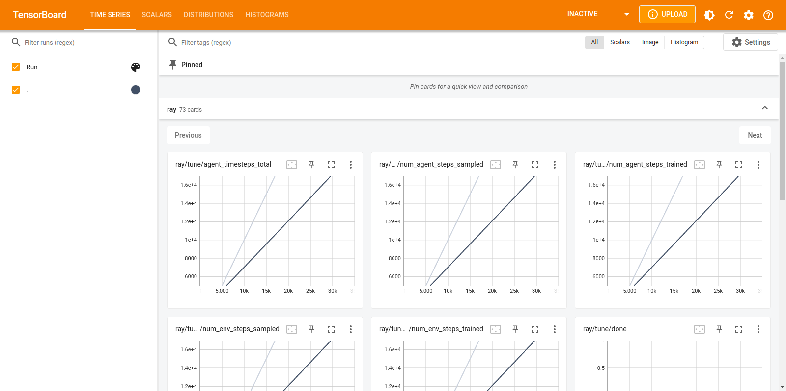
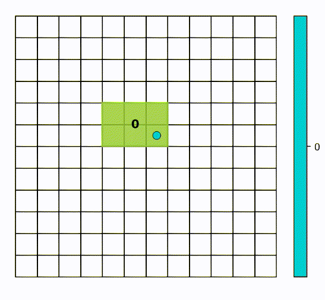
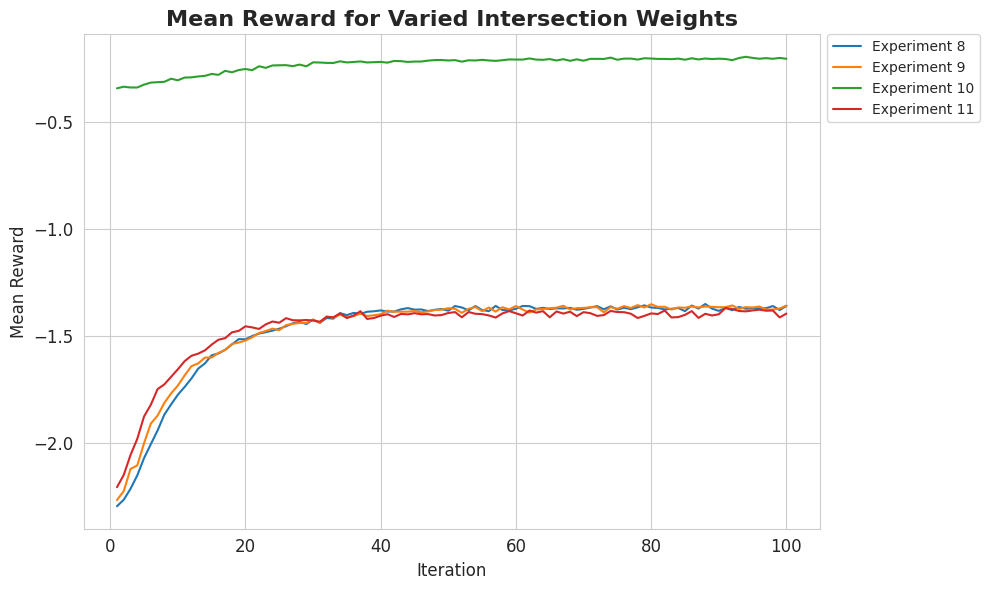
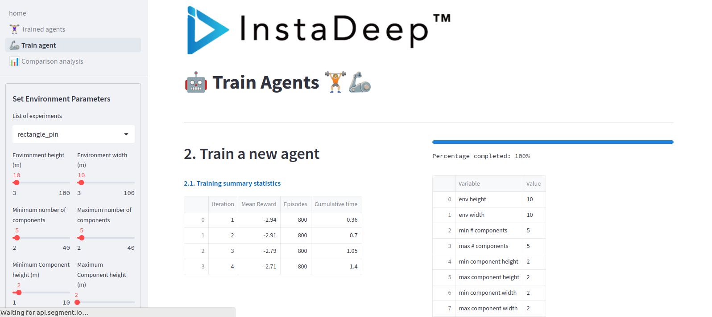
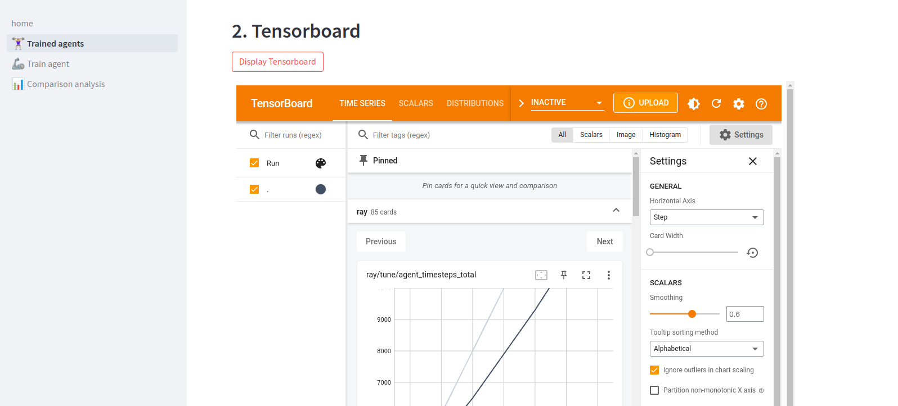
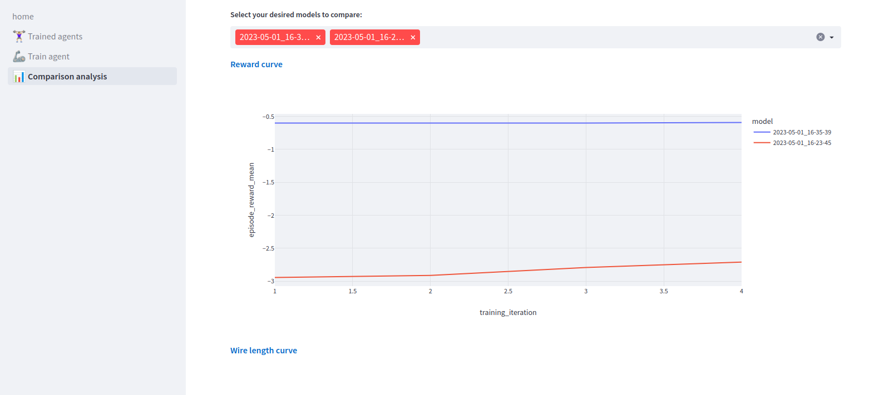

Usage
=====

This page covers examples for the various functionalities provided by this repository.
More detailed descriptions of these functionalities can be found in the :doc:`api` section.

.. _environments:

Environments
---------------

This repository provides four different environments of increasing complexity, where
each environment builds on the previous one. The base environment for all of these 
environments is the ``gym.Env`` class from `OpenAI Gym <https://gym.openai.com/docs>`_. 

The environments are detailed in the modules:

- :mod:`environment.dummy_env_square`
- :mod:`environment.dummy_env_rectangle`
- :mod:`environment.dummy_env_rectangle_pin`
- :mod:`environment.dummy_env_rectangle_pin_spatial`

.. _square:

Square Environment
~~~~~~~

The square environment consists of a grid of size height x width with components of fixed
size n x n. The goal of the agent is to place all components on the grid; this is achieved using
a dense reward where the agent receives a reward of 1 for each component placed on the grid and
0 otherwise. 

The agent places components on the grid by specifying the top-left coordinates of the component
on the grid. An episode is terminated once no more components can be placed on the grid, i.e.
when the action mask is all zeros.

A typical example usage would be:

>>> import gym
>>> from environment.dummy_env_square import DummyPlacementEnv
>>> env = DummyPlacementEnv(height=10, width=10, component_n=2)
>>> env.reset()
>>> env.step((0, 1))

------------

.. _rectangle:

Rectangle Environment
~~~~~~~~

The rectangle environment is similar to the square environment, except that the components
are now rectangular and of variable size. As components are now rectangular, the agent must
specify the top-left coordinates of the component on the grid as well as the orientation of
the component (horizontal or vertical).

Additionally, at reset the agent samples a list of components of random sizes where the goal is now
to place these components, in the order that they are sampled, on the grid. Again, an episode is
terminated once no more components can be placed on the grid, or there are no more remaining components.

A typical example usage would be:

>>> import gym
>>> from environment.dummy_env_rectangular import DummyPlacementEnv
>>> env = DummyPlacementEnv(
...     height=10,  
...     width=10,
...     min_component_w=1,
...     max_component_w=1,
...     min_component_h=3,
...     max_component_h=3,
...     max_num_components=5,
...     min_num_components=2,
... )

>>> env.reset()
>>> env.step((1, 0, 1))

------------

.. _rectangle_pin:

Rectangle Pin Environment
~~~~~~~~~~~~~~

The rectangle pin environment builds on the rectangle environment with several additional
features. Firstly, components now include pins and the concept of "nets" is introduced: a net
is a set of pins that must be connected. The agent must place components on the grid such that
nets are connected in the most "optimal" way possible.

As the goal of the agent no longer is to place all components on the grid, the reward function
is modified to be sparse: the agent receives a non-zero reward :math:`R` at the end of an episode and 
0 otherwise. The reward :math:`R` relates to how optimally the nets can be connected on the grid. To
approximate this, the nets are connected using either a "centroid" or "beam" search routing
algorithm, then the number of intersections between connections from different nets and the total
wirelength of the routing are used to calculate the reward:

.. math::
  R = \alpha \cdot \text{intersections} + \beta \cdot \text{wirelength}

where :math:`\alpha` and :math:`\beta` are weights that can be specified by the user. In the case where not all
the components are placed, an upper bound for :math:`\text{intersections}` and :math:`\text{wirelength}` is used
to encourage the agent to place as many components as possible on the grid.

Moreover, the reset mechanism is also now more sophisticated and includes sampling and
distributing pins amongst components and nets. Again, an episode is terminated once no 
more components can be placed on the grid, i.e. when the action mask is all zeros.

A typical example usage would be:

        height: int,
        width: int,
        net_distribution: int,
        pin_spread: int,
        min_component_w: int,
        max_component_w: int,
        min_component_h: int,
        max_component_h: int,
        max_num_components: int,
        min_num_components: int,
        min_num_nets: int,
        max_num_nets: int,
        max_num_pins_per_net: int,
        min_num_pins_per_net: int = 2,
        reward_type: str = "both",
        reward_beam_width: int = 2,
        weight_wirelength: float = 0.5,
        weight_num_intersections: float = 0.5,

>>> import gym
>>> from environment.dummy_env_rectangular_pin import DummyPlacementEnv
>>> env = DummyPlacementEnv(
...     height=10,
...     width=10,
...     net_distribution=1,
...     pin_spread=1,
...     min_component_w=1,
...     max_component_w=1,
...     min_component_h=3,
...     max_component_h=3,
...     max_num_components=5,
...     min_num_components=2,
...     min_num_nets=1,
...     max_num_nets=2,
...     max_num_pins_per_net=2,
...     min_num_pins_per_net=2,
... )

>>> env.reset()
>>> env.step((2, 0, 1))

------------

.. _rectangle_pin_spatial:

Rectangle Pin Spatial Environment
~~~~~~~~~~~~~~~~~~~~~~

The rectangle pin spatial environment works similarly to the rectangle pin environment, except
that the observations space is now modified to include spatial information about the components,
pins and nets.

------------

.. _agents:

Agents
------

This repository provides a number of agents that can be used to train on the different environments provided. The agents
are implemented using the ``RLlib`` library and are based on the PPO algorithm. An agent with a random policy is also provided
as a baseline.

The :mod:`agent.models` module contains the neural network architectures which are used as the policy network in the PPO algorithm and
the :mod:`agent.random` module contains the random policy for the different environments. For the rectangular pin environment, a random policy
is only provided for the non-spatial version of the environment as the policy would be identical for the spatial version of the environment. 
Detailed description of the models can be found in the modules.

We describe ways to train different agents, view and compare results below.

------------

.. _train_random:

Training with a Random Policy
~~~~~~~~~~~~~~~~~~~~~~~

The :mod:`experiments.random_policy` module contains the script for running a random policy on the different environments provided. The
results of the experiments are saved in the ``results`` directory.

As an example, to run a random policy on the square environment with a grid of size 10 x 10, components of size 2 x 2
and 1000 episodes the following command should be ryn from the root directory of the repository:

.. code-block:: bash
  
      python experiments/random_policy/run_policy_square.py --policy_type random --num_episodes 1000 --env_height 10 --env_width 10 --component_size 2

The episde returns of the experiment will be saved in the ``results`` directory as ``square_env_random_policy_episode_returns.png``:

.. image:: /_figures/square_env_random_policy_episode_returns.png
   :width: 100%
   :align: center

------------

.. _train_ppo:

Training with a PPO Agent
~~~~~~~~~~~~~~~~~~~~~~~

The :mod:`agent.models` module contains the neural network architectures which are used as the policy network in the PPO algorithm
for the different environments. A brief description of these models is given in the table below and a more detailed description can be 
found in the module.

.. list-table:: Model descriptions
   :widths: 25 25 50
   :header-rows: 1

   * - Model
     - Environment
     - Description
   * - :class:`agent.models.SquareEnvModel`
     - Square
     - Encodes the grid using a CNN and uses this encoding to predict the action logits and value function with a dense layer.
   * - :class:`agent.models.RectangleModel`
     - Rectangular
     - Encodes the grid using a CNN and encodes the component features using a dense layer. These encodings are concatenated and passed through a dense layer to predict the action logits and value function.
   * - :class:`agent.models.RectangleFactorizedModel`
     - Rectangular
     - Same as :class:`agent.models.RectangleModel` except that now the action space is factorised and there are three separate action models for the x, y and orientation actions; all these models are dense layers and use the grid and component features encodings.   
   * - :class:`agent.models.RectanglePinModel`
     - Rectangular pin
     - Uses the same grid encoding as :class:`agent.models.SquareEnvModel` with the addition of encodings for the component features, pin feautres and placement mask. These encodings are created with dense layers and used to predict the action logits and value function.
   * - :class:`agent.models.RectanglePinAttnCompModel`
     - Rectangular pin
     - Same as :class:`agent.models.RectanglePinModel` except that the final encoding is now passed through a self-attention layer before being used to predict the action logits and value function.
   * - :class:`agent.models.RectanglePinAttnCompPinModel`
     - Rectangular pin    
     - Same as :class:`agent.models.RectanglePinAttnCompModel` except that the encoding of the pin features is created using a self-attention layer.
   * - :class:`agent.models.RectanglePinAttnAllNoGridModel`
     - Rectangular pin    
     - Same as :class:`agent.models.RectanglePinAttnCompPinModel` except that the encoding of the grid is no longer used.
   * - :class:`agent.models.RectanglePinSpatialModel`
     - Rectangular pin spatial
     - Creates endcodings of the grid, pins and component features using a CNN by representing them all together spatially. These encodings are concatenated and passed through a dense layer to predict the action logits and value function.
   * - :class:`agent.models.RectanglePinFactorizedModel`
     - Rectangular pin    
     - Same as :class:`agent.models.RectanglePinModel` except that now the action space is factorised and there are three separate action models for the x, y and orientation actions; all these models are dense layers and use the grid and component features encodings.
   * - :class:`agent.models.RectanglePinAllAttnFactorized`
     - Rectangular pin    
     - Same as :class:`agent.models.RectanglePinFactorizedModel` except that the encodings are created in the same way as :class:`agent.models.RectanglePinAttnCompPinModel`.
    
        
To train an agent using one of the above policy networks, the corresponding config file in the ``agent/configs`` directory 
should first be modified. The config files includes the hyperparameters for the PPO algorithm policy network as well as the environment configuration.

Once the corresponding config file has been modified in the desired way, an agent can be trained by running the following command
from the root repository, where in this example we are training the :class:`agent.models.RectanglePinAttnCompPinModel` model on the
rectangular pin environment:

.. code-block:: bash
  
      python experiments/PPO/PPO.py --type rectangle_pin_attn_all

where ``type`` refers the neural network architecture used for the policy network (this also implicitly specifies the type of the environment).

------------

.. _tensorboard:

Viewing Results with Tensorboard
~~~~~~~~~~~~~~~~~~~~~~~

Once an experiment has been run, the results are by default saved in ``~/ray_results/``; the location of the results 
can be changed by changing the ``local_dir`` parameter in the ``tune.run()`` function in the ``agent/PPO.py`` script. The 
results include the checkpoints of the agent at different points during training as well as the logs of the training
process. 

The directory strucutre of the saved results looks like the following:

.. code-block:: bash

    .
    └── ray_results
        └── experiment_name
            ├── checkpoint_000001
            │   ├── checkpoint
            │   ├── params.pkl
            │   └── tune_metadata
            ├── checkpoint_000002
            │   ├── checkpoint
            │   ├── params.pkl
            │   └── tune_metadata
            ├── checkpoint_000003
            │   ├── checkpoint
            │   ├── params.pkl
            │   └── tune_metadata
            ├── ...
            ├── log_syncer.out
            ├── params.json
            └── progress.csv

The ``progress.csv`` file contains information about the training progress, such as the training and evaluation metrics for 
each checkpoint. The ``params.json`` file contains the hyperparameters for the experiment in JSON format. The 
log_syncer.out file contains the log output from the experiment.

The logs can be viewed using `Tensorboard <https://www.tensorflow.org/tensorboard/get_started#:~:text=TensorBoard%20is%20a%20tool%20for,dimensional%20space%2C%20and%20much%20more.>`_ by running the following commands from the root directory of the repository:

.. code-block:: bash

    cd ~
    tensorboard --logdir ~/ray_results/PPO/<experiment_name>

The logs can be viewed in a web browser at the address ``localhost:6006``:

------------

.. _rollouts:

Viewing Sample Rollouts
~~~~~~~~~~~~~~~~~~~~~~

In order to analyse the performance of a trained agent, it is useful to view sample rollouts of the policy, particularly 
as the agent improves during training. For a trained agent, sample rollouts of the policy for a given checkpoint can be 
retrieved by running the following code:

>>> from utils.agent.utils import sample_rollout, get_config
>>> model_type = "rectangle_pin_attn_all"  # type of the agent trained
>>> checkpoint_path = "path/to/checkpoint"  # path to the checkpoint of the agent
>>> config = get_config(model_type)  # get the config for the agent
...
>>> samples_components, samples_actions = sample_rollout(config, checkpoint_path, model_type)

The above code will return the components and actions for the sample rollouts. To view this result as a series of images,
the following code can be run:

>>> from web_app import visualization_grid as vg
>>> height = config["env_config"]["height"]
>>> width = config["env_config"]["width"]
>>> sample_num = 0  # sample number to view
>>> for i in range(1, len(samples_actions[sample_num]) + 1):
>>>     fig = vg.render(height, width, samples_components[sample_num][:i], samples_actions[sample_num][:i])
>>>     fig.savefig(f"results/rollout_{i}.png")

An example of a rollout for a trained :class:`agent.models.RectanglePinAttnCompPinModel` model is shown below:

In the above plot, the pins are coloured according to the net that they belong to. An alternative, faster way to view 
sample rollouts is also discussed in the :ref:`web_app` section.

------------

.. _comparing_multiple_agents:

Comparing Multiple Agents
~~~~~~~~~~~~~~~~~~~~~~~

It is also possible to compare the performance of multiple agents by viewing the evaluation metrics for each agent
on a single plot. The easiest way to do this, is to extract the ``progress.csv`` files for each agent from the 
results directory and place them in a separate directory. Then, the results of all the agents can be condensed into
a list of dataframes to use for plotting:

>>> import pandas as pd
>>> import numpy as np
>>> from pathlib import Path
...
>>> dir_path = str(Path.home()) + "/ray_results/experiments_csvs/"  # path to directory containing the progress.csv files from the home directory
>>> path_to_experiment_data = dir_path
>>> experiment_ids = [8, 9, 10, 11]  # experiment ids of agents to compare
>>> experiment_dfs = [pd.read_csv(path_to_experiment_data + "experiment-" + str(experiment_id) + '.csv') for experiment_id in experiment_ids] # name the progress.csv files according to their experiment id

The ``experiment_dfs`` list contains the dataframes for each agent. These dataframes can then be used to plot the evaluation
metrics for each agent on a single plot:

>>> import matplotlib.pyplot as plt
>>> import seaborn as sns
...
>>> sns.set_style("whitegrid")
>>> evaluation_metric = 'episode_reward_mean'
>>> fig, ax = plt.subplots(figsize=(10, 6))
>>> for id, experiment_df in enumerate(experiment_dfs, 8):
...     sns.lineplot(data=experiment_df, x='training_iteration', y=evaluation_metric, label=f"Experiment {id}", ax=ax)  
...
>>> metric_name = "Mean Reward"
>>> ax.set_title(f"{metric_name} for Varied Intersection Weights", fontsize=16, fontweight='bold')
>>> ax.set_xlabel("Iteration", fontsize=12)
>>>ax.set_ylabel(metric_name, fontsize=12)
>>> ax.tick_params(axis='both', labelsize=12)
>>> ax.legend(bbox_to_anchor=(1.01, 1), loc='upper left', borderaxespad=0.)
>>> plt.tight_layout()
>>> plt.show()

An example of training different agents with a fixed value for :math:`\beta` and varying values for :math:`\alpha` is shown below:

------------

.. _web_app:

Web App
---------------

The repository also contains a streamlit web app that can be used to:

* Train agents
* View training results
* View sample rollouts of trained agents
* Compare the performance of multiple agents

The web app can be run by running the following command from the root directory of the repository:

.. code-block:: bash

    streamlit run web_app/home.py

A brief description of the different pages is given in the table below:

.. list-table:: Page description
   :widths: 20 50
   :header-rows: 1

   * - Page
     - Description
   * - Home
     - The home page of the web app. From here, the user can navigate to the other pages of the web app.
   * - Train agent
     - This page allows you to train agents on specific environments.
   * - Trained agents
     - This page allows you to view the statistics of past trained agents on specific environments.
   * - Comparison analysis
     - This page allows you to compare the performance of different trained agents on specific environments.

.. note::
   :class: yellow-note

   Currently the web can only be used for the :mod:`agent.models.RectanglePinModel` model.

------------

.. _train_agents:

Train agents
~~~~~~~~~~~~~~~~~~~~~~~

The ``Train agent`` page allows you to train agents on specific environments. To train an agent, select the environment
configurations and agent hyperparameters and click the ``Run model!`` button. The training progress can be viewed in the 
``Trained agents`` page. The ``Train agent`` page is shown below:

By default, the results of the training will be saved in the ``ray_results`` directory.

------------

.. _trained_agents:

Trained agents
~~~~~~~~~~~~~~~~~~~~~~~

The ``Trained agents`` page allows you to:

* View the training progress of past trained agents on specific environments
* View sample rollouts of past trained agents
* View the tensorboard logs of past trained agents

To select a trained agent, select the timestap corresponding to the desired agent under the ``List of previous
experiments`` dropdown. This then displays the input parameters for the selected environment, mean rewards for each
iteration and a plot of the mean reward vs iteration. An example of the results for a trained agent shown below:

.. image:: ../_figures/web_app_trained_agents.png
   :width: 100%
   :align: center

A sample rollout of the selected agent (using the last saved checkpoint) can be viewed by clicking the ``Display Policy Rollout``
button.

Lastly, the Tensorboard for the selected agent can be viewed by clicking the ``Display Tensorboard`` button:

------------

.. _comparison_analysis:

Comparison analysis
~~~~~~~~~~~~~~~~~~~~~~~

The ``Comparison analysis`` page allows you to compare the performance of different trained agents. A dataframe of the
previously trained agents is shown in the ``Input parameters`` table. To select the agents to compare, choose the
agents from the ``Select your desired models`` dropdown. This displays the mean reward vs iteration plot for the selected agents 
as well as two additional plots for the normalized wirelength and normalized number of intersections vs iterations for the 
selected agents. An example of two identical agents with different reward weights is shown below:

